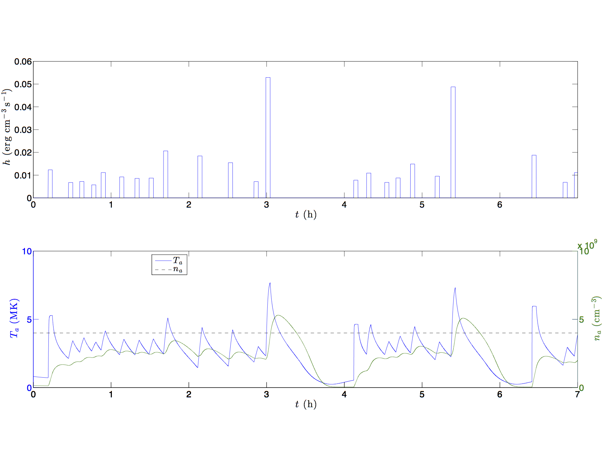

#EBTEL-C

##Authors
EBTEL was originally coded in the Interactive Data Language (IDL) by J.A. Klimchuk, S. Patsourakos, and P.J. Cargill. This version is a translation into the C Programming Language by Will Barnes, Rice University.

For more information regarding the EBTEL model see:

+ <a href="http://adsabs.harvard.edu/abs/2008ApJ...682.1351K">Klimchuk et al. 2008, ApJ, 682:1351-1362</a>
+ <a href="http://adsabs.harvard.edu/abs/2012ApJ...752..161C">Cargill et al. 2012A, ApJ, 752:161</a>
+ <a href="http://adsabs.harvard.edu/abs/2012ApJ...758....5C">Cargill et al. 2012B, ApJ, 758:5</a>

##Model Details
The Enthalpy Based Thermal Evolution of Loops (EBTEL) model allows one to efficiently compute spatially-averaged, time-dependent plasma parameters. It is often desirable to compute solutions for a large number of coronal loops. However, the spatial and temporal scales needed to solve the full _1D_-hydrodynamic equations lead to long computation times. EBTEL allows for quick and accurate solutions to spatially-averaged quantities which allows for an analysis of how the coronal plasma responds to time-dependent heating. Comparisons to _1D_-models have shown (see above publications) that the EBTEL solutions are able to reproduce averaged _1D_-results to a surprising degree of accuracy.

Using a time-dependent heating function, EBTEL computes the plasma response of the temperature, pressure, and number density by solving the _0D_ hydrodynamic equations. These are derived by integrating and energy and mass equations over the coronal and transition region portions of the loop. It is also assumed that the ratios of the average temperature to the apex temperature and the base temperature to the apex temperature are constants.

EBTEL also calculates the differential emission measure as a function of temperature (_DEM(T)_) for the transition region and the corona. Details regarding the specific equations can be found in the above publications.

##Updates in EBTEL-C
The EBTEL-C code offers several advantages over the original IDL code. Perhaps the biggest advantage is the time needed to compute a single run. A typical EBTEL-C run (_~20,000_ s) takes approximately 0.5 seconds as opposed to the _~10_ s that a an EBTEL-IDL run would need (Though it should be noted that this is still efficient compared to a _1D_ hydrodynamic simulation). This drastic increase in speed is due mostly to addition of an adaptive fourth-order Runge-Kutta routine to solve the EBTEL equations. The amount by which the step-size is allowed to vary can be adjusted to allow for greater accuracy or greater speed, whichever is more necessary for the user. 

Additionally, EBTEL-C comes with a more flexible heating function that allows the user to use a variable number of uniform or randomly-occuring heating events or provide an input-file that specifies the heating profile. 

It should be noted that extensive testing has been carried out to ensure that EBTEL-C solutions match those of the EBTEL-IDL solutions such that no additional error is introduced in the translation.

##Dependencies
EBTEL-C uses an XML configuration file system to minimize errors that result from poorly formatted input files and allow for easier input readability. EBTEL-C uses the XML C parser toolkit `libxml2` which provides a number of useful functions and datatypes for parsing structured XML files. The toolkit, which is essentially a collection of header files, can be obtained <a href="http://xmlsoft.org/downloads.html">here.</a> Additionally, Mac users can obtain the library using the MacPorts package manager by using `sudo port install libxml2`. Linux users can obtain the library via the built-in Aptitude package manager.

**NOTE: If you use the build procedure described below to compile EBTEL-C, you must first change the include location of the `libxml2` library in `src/makefile`.** At the top of the file, the variable `IFLAGS` specifies the location of your local copy of the `libxml2` directory containing all of the necessary header files. For example, if the `libxml2` directory is in `/opt/local/include`, then the line in your makefile would be:

+ `IFLAGS=-I /opt/local/include/libxml2`

You of course may also choose to compile EBTEL-C by hand or write your own `makefile`.

##Downloading and Compiling
Linux and Mac users should be able to compile and run EBTEL-C in the terminal. Windows users should compile and run the code in the Cygwin environment (<a href="https://www.cygwin.com/">available here</a>). The best way to obtain this code is to clone a copy of this repository on your local machine. If you have `git` installed locally, create a working copy by typing `git clone https://github.com/rice-solar-physics/EBTEL_C.git` at the command line. Changes may be made periodically to the main EBTEL-C repository. To pull down these changes, but not override any local changes, use `git pull` inside of your working directory. You can also simply download a compressed file containing all of the source code if you do not wish to bother with the version control.

To compile EBTEL-C, switch to the `build` directory and run `./build`. This uses a makefile in `src` to compile the source code and place an executable called `ebtel` in the `bin` directory. Additionally, running './clean' in `build` removes the executable and all of the object files created at compile time.

To run EBTEL-C, simply run `./ebtel` <b>in the `bin` directory.</b> EBTEL-C also accepts two optional command line arguments: (1) `quiet` which silences the header printed by default and (2) a custom configuration filename. If no filename is specified, the default filename `../config/ebtel_config.xml` will be used. Custom filename paths should all be relative to the EBTEL-C root directory. The order of the two arguments can be arbitrary. All of the following are valid calls of the EBTEL-C executable:

+ `./ebtel`
+ `./ebtel quiet`
+ `./ebtel quiet ../config/new_ebtel_config_file.xml`
+ `./ebtel ../config/new_ebtel_config_file.xml`  

##Configuring Input Parameters
There are two input files that drive the EBTEL-C code: one that configures the initial conditions as well as options like which solver or radiative loss function to use and another one that configures options relating to the heating function.

Structure of `ebtel_parameters.txt`:

1. total time (in seconds)
2. time step (in seconds)--for the Euler method, this is true for every step; for the adaptive method, this is only the initial time step.
3. heating shape--(1) triangular heating pulse, (2) square heating pulse, (3) Gaussian heating pulse
4. loop half-length (in Mm)--loop length measured from the base of the transition region to the loop apex
5. usage--(1) include DEM calculation, (2) leave out DEM calculation, (3) include non-thermal electron heating, (4)compute radiation ratio and DEM calculation. Note that options (1) and (4) result in ~25% increase in computation time.
6. radiative loss option--(0)use Raymond-Klimchuk loss function, (1) use Rosner-Tucker-Vaiana loss function
7. DEM option--(0) use new DEM calculation, (1) use old DEM calculation
8. flux option--(0) use classical heat flux calculation, (1) include flux limiting in heat flux calculation
9. solver--(0) use Euler solver, (1)use 4th-order Runge-Kutta solver, (2) use adaptive method coupled to 4th-order Runge-Kutta solver.
10. input mode--(0) initial conditions calculation using static equilibrium, (1) initial conditions read in from input file, (2) initial conditions calculated using scaling laws.
11. heating amplitude (erg cm^-3 s^-1)--maximum value of heating function.
12. pulse half-time (in seconds)--duration of heating event divided by two.
13. start time (in seconds)--time at which heating event begins
14. DEM index--index that defines temperature range over which the DEM is computed.
15. error--value (default 1e-6) that defines the allowed error tolerance in the adaptive time step routine.
16. T0 (in K)--temperature at time _t=0_s
17. n0 (in cm^-3)--number density at time _t=0_s

Structure of `ebtel_heating_parameters.txt`:

1. N--number of heating events
2. hback (in ergs cm^-3 s^-1)--value of background heating 
3. start time mean (in seconds)--mean value of normally distributed start times
4. start time standard deviation (in seconds)--standard deviation of normally distributed start times
5. alpha--power law index for event amplitude distribution
6. amp0 (in ergs cm^-3 s^-1)--lower bound on amplitude power law distribution
7. amp1 (in ergs cm^-3 s^-1)--upper bound on amplitude power law distribution
8. start time option--(uniform): gives N heating events starting at the given start time separated by 2*pulse-half-time; (random): selects N start times from a normal distribution with the given mean and standard deviation. The actual number of events is given by the number of start times that fall within [0,total time]; (file): read in start times from given file.
9. amplitude option--uniform: gives N heating events with uniform amplitude as specified by the parameter file; random: selects N heating amplitudes from a power law distribution with index alpha; file: read in amplitudes from given file.
10. end time option--(uniform): computes end time by adding 2*pulse half time to each start time giving uniform width to each event; (file): reads in the end times from given file.
11. start file--if file option is selected for start time option, then the start times are read in using this filename
12. amp file--if file option is selected for amplitude option, the amplitudes are read in using this filename
13. end file--if file option is selected for end time option, the end times are read in using this filename

##Reporting Bugs and Issues
If you find any bugs or have any concerns about the code, create an Issue or submit a pull request. Questions can also be directed to `will (dot) t (dot) barnes (at) rice (dot) edu`.
