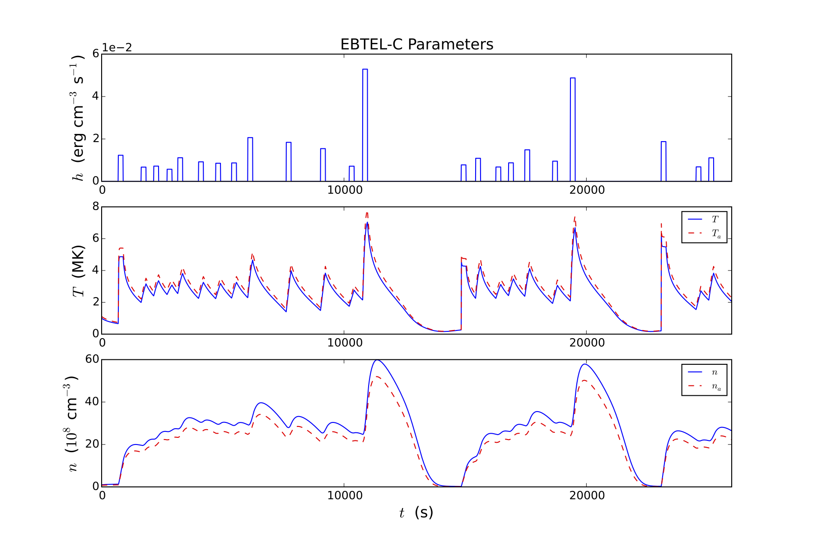

#EBTEL-C

##Authors
EBTEL was originally coded in the Interactive Data Language (IDL) by J.A. Klimchuk, S. Patsourakos, and P.J. Cargill. This version is a translation into the C Programming Language by Will Barnes, Rice University.

For more information regarding the EBTEL model see:

+ <a href="http://adsabs.harvard.edu/abs/2008ApJ...682.1351K">Klimchuk et al. 2008, ApJ, 682:1351-1362</a>
+ <a href="http://adsabs.harvard.edu/abs/2012ApJ...752..161C">Cargill et al. 2012A, ApJ, 752:161</a>
+ <a href="http://adsabs.harvard.edu/abs/2012ApJ...758....5C">Cargill et al. 2012B, ApJ, 758:5</a>

The original IDL code can be found <a href="https://github.com/rice-solar-physics/EBTEL">here</a>.

##Model Details
The Enthalpy Based Thermal Evolution of Loops (EBTEL) model allows one to efficiently compute spatially-averaged, time-dependent plasma parameters. It is often desirable to compute solutions for a large number of coronal loops. However, the spatial and temporal scales needed to solve the full _1D_-hydrodynamic equations lead to long computation times. EBTEL allows for quick and accurate solutions to spatially-averaged quantities which allows for an analysis of how the coronal plasma responds to time-dependent heating. Comparisons to _1D_-models have shown (see above publications) that the EBTEL solutions are able to reproduce averaged _1D_-results to a surprising degree of accuracy.

Using a time-dependent heating function, EBTEL computes the plasma response of the temperature, pressure, and number density by solving the _0D_ hydrodynamic equations. These are derived by integrating and energy and mass equations over the coronal and transition region portions of the loop. It is also assumed that the ratios of the average temperature to the apex temperature and the base temperature to the apex temperature are constants.

EBTEL also calculates the differential emission measure as a function of temperature (_DEM(T)_) for the transition region and the corona. Details regarding the specific equations can be found in the above publications.

##Updates in EBTEL-C
The EBTEL-C code offers several advantages over the original IDL code. Perhaps the biggest advantage is the time needed to compute a single run. A typical EBTEL-C run (_~20,000_ s) takes approximately 0.5 seconds as opposed to the _~10_ s that a an EBTEL-IDL run would need (Though it should be noted that this is still efficient compared to a _1D_ hydrodynamic simulation). EBTEL-C also incorporates an adaptive fourth-order Runge-Kutta routine to solve the EBTEL equations. The amount by which the step-size is allowed to vary can be adjusted to allow for greater accuracy or greater speed, whichever is more necessary for the user. 

Additionally, EBTEL-C comes with a more flexible heating function that allows the user to use a variable number of uniform or randomly-occurring heating events or provide an input-file that specifies the heating profile. 

It should be noted that extensive testing has been carried out to ensure that EBTEL-C solutions match those of the EBTEL-IDL solutions such that no additional error is introduced in the translation.

##Dependencies
EBTEL-C uses an XML configuration file system to minimize errors that result from poorly formatted input files and allow for easier input readability. EBTEL-C uses the XML C parser toolkit `libxml2` which provides a number of useful functions and datatypes for parsing structured XML files. The toolkit can be found <a href = "http://xmlsoft.org/downloads.html">here</a> though manual installation is not advised. Mac users can obtain the library using the <a href="https://www.macports.org/">MacPorts</a> package manager by running `sudo port install libxml2`. Linux users can obtain the library via the built-in Aptitude package manager by running `sudo apt-get install libxml2`. Windows users should install libxml2 through <a href="https://www.cygwin.com/">Cygwin</a>. Note that you will need to manually select the package when you install Cygwin. **Provided the `libxml2` library is installed through one of the above methods, no additional changes should be needed to compile and run EBTEL-C.**

**NOTE: If you use the build procedure described below to compile EBTEL-C and have not obtained `libxml2` through the above channels, you must first change the include location of the `libxml2` library in `src/makefile`.** The Makefile located in `src/makefile` is configured to detect the OS and change the compiler flags appropriately. However, if you are having trouble with default build procedure, you may need to modify the following lines in `src/makefile`:

+ `LFLAGS=-lxml2 -lz -liconv -lm`
+ `IFLAGS=-I /opt/local/include/libxml2`

Note that the `IFLAGS` option specifies the location of the top-level `libxml2` directory. If you have built `libxml2` in a directory other than the default directories or have moved the files, you will need to alter these lines. 

##Downloading and Compiling
Linux and Mac users should be able to compile and run EBTEL-C in the terminal. Windows users should compile and run the code in the <a href="https://www.cygwin.com/">Cygwin</a> environment. The best way to obtain this code is to clone a copy of this repository on your local machine. This allows you to keep your copy of EBTEL-C up to date with the main repository. You can also simply download a compressed file containing all of the source code if you do not wish to bother with the version control.

To compile EBTEL-C, switch to the `build/` directory and run `./build`. This uses a makefile in `src/` to compile the source code and place an executable called `ebtel` in the `bin/` directory. Additionally, running `./clean` in `build/` removes the executable and all of the object files created at compile time.

To run EBTEL-C, switch to the `bin/` directory and run `./ebtel`. EBTEL-C also accepts two optional command line arguments: (1) `quiet` which silences the header printed by default and (2) a custom configuration filename. If no filename is specified, the default filename `../config/ebtel_config.xml` will be used. The order of the two arguments is arbitrary. All of the following are valid calls of the EBTEL-C executable:

+ `./ebtel`
+ `./ebtel quiet`
+ `./ebtel quiet ../config/new_ebtel_config_file.xml`
+ `/home/user/EBTEL-C/bin/ebtel /home/user/EBTEL-C/config/new_ebtel_config_file.xml` 

See the description of the `output_file` input parameter for information on where results from EBTEL-C are printed. 

##Configuring Input Parameters
As stated above, EBTEL-C uses an XML configuration file system as opposed to a traditional text file input configuration. XML files allow for increased readability because the context of each parameter (the so-called "node name") is included in the input configuration. Additionally, the order of the input parameters in the configuration file is arbitrary since XML uses keywords rather than the order of the values to associate specific values with specific tags. A sample configuration file is provided in `config/ebtel_config.xml`. Below is a list of the input parameters set by the input configuration file along with a brief description. 

+ General input parameters
  + total_time (s) -- the total amount of time allotted for the simulation
  + tau (s) -- time step; static for Euler and Runge-Kutta solvers; starting time step for adaptive Runge-Kutta solver
  + loop_length (Mm) -- loop half-length; measured from the base of the transition region to the loop apex
  + usage_option -- `dem` include DEM calculation, `no_dem` leave out DEM calculation, `nt_ebeam` include non-thermal electron heating term in pressure equation (this option has NOT been extensively tested with EBTEL-C), `rad_ratio` compute radiation and heat flux ratios and perform DEM calculation. Note that the first and fourth options require longer compute times. If you are only interested in the temperature and density profiles, the second option (`no_dem`) is the recommended choice.
  + rad_option -- choose how to calculate the radiative loss function: `rk` use Raymond-Klimchuk loss function or `rtv` use Rosner-Tucker-Vaiana loss function
  + dem_option -- method for calculating transition region DEM; use either the `new` or `old` method; see <a href="http://adsabs.harvard.edu/abs/2008ApJ...682.1351K">Klimchuk et al. (2008)</a> for details on the differences between these two options
  + heat_flux_option -- EBTEL uses the Spitzer-Harm formula to calculate the heat flux; a flux limiter can be applied by using the `limited` option; to calculate the heat flux without the flux limit, use the `classical` option.
  + solver -- three different solvers are available in EBTEL-C: `euler` Euler solver, `rk4` 4th-order Runge-Kutta solver, `rka4` adaptive method coupled to 4th-order Runge-Kutta solver.
  + ic_mode -- choose how to calculate the initial conditions: `st_eq` static equilibrium calculation, `force` initial conditions read in from input file, `scaling` scaling laws calculation.
  + output_file -- `default` option prints all results to the `data` directory in the EBTEL-C root directory using the format `ebteldatL{loop_length}_{usage_option}_{heating_shape}_{solver}.txt`; DEM results will include `_dem`; alternatively, you may use this input option to specify a path to a custom output file
  + print_plasma_params -- `True` prints all plasma parameters (_T_,_n_,_p_,etc.) to file specified by `output_file`, not including the DEM results; `False` skips the printing of these parameters. Set this option to `False` if, for example, you are running EBTEL many times and only looking at the DEM results and want to save space. Runtimes of tens of thousands of seconds can generate data files in excess of tens of megabytes so this option may be desirable if many runs are being computed.
  + rka_error -- value that defines the allowed error tolerance in the adaptive time step routine; 1.0e-6 is the recommended value
  + index_dem -- index that defines temperature range over which the transition region DEM is computed; 451 is the recommended value.
  + T0 (K) -- temperature at time _t=0_ s
  + n0 (cm^-3) -- number density at time _t=0_ s
  + sat_limit -- coefficient on saturation value of the heat flux; beta in Eq. 21 of <a href="http://adsabs.harvard.edu/abs/2008ApJ...682.1351K">Klimchuk et al. (2008)</a>
+ Heating parameters
  + heating_shape -- shape of the heating pulse; three possible options: `triangle`, `square`, or `gaussian`
  + num_events -- number of heating events (Note that The actual number of events is given by the number of start times that fall within [0,total time])
  + t_start (s) -- time at which the first heating event begins
  + t_pulse_half (s) -- duration of heating event divided by two; for a triangular pulse, this is the time between the start of the event and when the heating amplitude reaches its maximum; for a square pulse, this is just half of the event duration; for a gaussian pulse. this is the sigma parameter.
  + h_back (erg cm^-3 s^-1) -- background heating value
  + t_start_switch -- `uniform`: gives `num_events` heating events beginning at `t_start` separated by 2*`t_pulse_half`; `normal`: selects N start times from a normal distribution with the given mean `mean_t_start` and standard deviation `std_t_start`; `file`: read in start times from values in the `start_time_array` node
    + mean_t_start (s) -- mean value of normally distributed heating event start times
    + std_t_start (s) -- standard deviation of normally distributed start times
  + amp_switch -- `uniform`: gives `num` heating events with uniform amplitude `h_nano`; `power_law`: selects `num_events` heating amplitudes from a power law distribution with index `alpha` and bounds [`amp0`,`amp1`]; `file`: read in amplitudes from values in the `amp_array` node.
    + h_nano (erg cm^-3 s^-1) -- maximum heating amplitude.
    + alpha -- power law index for heating event amplitude distribution
    + amp0 (erg cm^-3 s^-1) -- lower bound on amplitude power law distribution
    + amp1 (erg cm^-3 s^-1) -- upper bound on amplitude power law distribution
  + t_end_switch -- `uniform`: computes end time by adding 2*`t_pulse_half` to each start time giving uniform width to each event; `file`: reads in end times from values in the `end_time_array` node.
  + start_time_array -- node that contains start times to be read in if `t_start_switch` is set to `file`
  + amp_array -- node that contains amplitudes to read in if `amp_switch` is set to `file`
  + end_time_array -- node that contains end times to be read in if `t_end_switch` is set to `file`
  
Note that when reading in start time, end time, or amplitude arrays from the array nodes, the format for the values should be `<parent_tag#>value</parent_tag#>`. For example, if you wanted to read in the start time for the first heating event as occurring at 100 s, inside of the `start_time_array` node, you should place `<start_time_array0>100</start_time_array0>`. A complete example is provided in `config/ebtel_config.xml`.

##Wrappers
To assist in the printing of configuration files and plotting of results, I have provided a few simple Python routines (located in `bin/`) that print an XML configuration file, run the `ebtel` executable, and then plot the resulting temperature, density, and heating profiles. Note that these routines require both the <a href="http://matplotlib.org/">Matplotlib</a> and <a href="http://www.numpy.org/">Numpy</a> Python libraries.

The `bin/ebtel_wrapper.py` script provides four different functions:

+ `plot_ebtel_dem`--plots the coronal, TR, and total DEM versus temperature
+ `plot_ebtel`--plots the temperature, density, and heating profiles for an EBTEL-C run; figures can be shown on-screen or printed to a file
+ `run_ebtel`--runs the `ebtel` executable for a specified configuration file; alternatively, a whole directory of config files can be specified and an EBTEL-C run will be started for each configuration file in the directory
+ `print_xml_config`--prints an XML configuration file for EBTEL-C from a Python dictionary; this is especially useful when one wants to manually specify starting and ending times as well as amplitudes for heating events

Additional documentation can be found in `bin/ebtel_wrapper.py`. The script `bin/ebtel_starter.py` shows an example of how to use these functions to start an EBTEL-C run. All of the Python scripts can also be easily modified to fit the specific needs of the user.

##Reporting Bugs and Issues
If you find any bugs or have any concerns about the code, create an Issue or submit a pull request. Questions can also be directed to `will (dot) t (dot) barnes (at) rice (dot) edu`.
